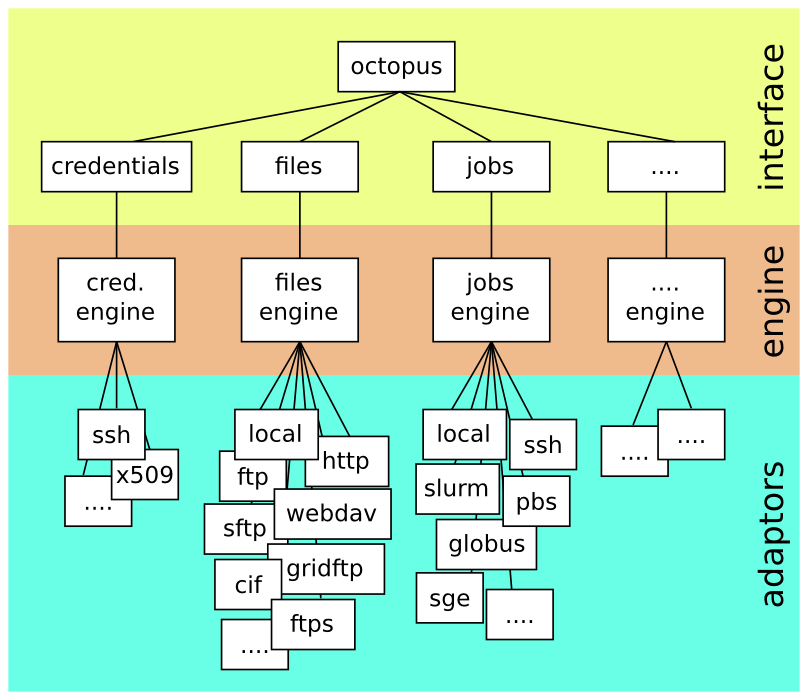

Octopus
=======

Copyright 2013 The Netherlands eScience Center

Author: Jason Maassen (<J.Maassen@esciencecenter.nl>)

Version: Userguide v0.2, Octopus v1.0rc1

Last modified: 22 August 2013

Copyrights & Disclaimers
------------------------

Octopus is copyrighted by the Netherlands eScience Center and releases under 
the Apache License, Version 2.0.

See the "LICENSE" and "NOTICE" files in the octopus distribution for more 
information. 

For more information on the Netherlands eScience Center see:

<http://www.esciencecenter.nl> 

The octopus project web site can be found at:

<https://github.com/NLeSC/octopus>.

This product includes the SLF4J library, which is Copyright (c) 2004-2013 QOS.ch
See "notices/LICENSE.slf4j.txt" for the licence information of the SLF4J library. 

This product includes the JSch library, which is Copyright (c) 2002-2012 Atsuhiko 
Yamanaka, JCraft,Inc. See "notices/LICENSE.jsch.txt" for the licence information 
of the JSch library.

What is it?
-----------

Octopus is a middleware abstraction library. It provides a simple Java 
programming interface to various pieces of software that can be used to 
access distributed compute and storage resources. 

Why Octopus?
------------

Octopus is developed by the Netherlands eScience Center as a support library 
for our projects. Several projects develop end-user applications that require 
access to distributed compute and storage resources. Octopus provides a simple 
API to access those resources, allowing those applications to be developed more 
rapidly. The experience gained during the development of these end-user 
applications is used to improve the Octopus API and implementation. 

Installation
------------

The installation procedure and dependencies of the octopus library can be found 
in the file "INSTALL.md" in the octopus distribution. 

Design
------

Octopus is designed with extensibility in mind. It uses a modular and layer design
as shown in the figure below:

	
Octopus consists of three layers, an *interface layer*, an *engine layer* and an 
*adaptor layer*. 

The *interface layer* is used by the application using octopus. It contains several 
specialized interfaces:

* Octopus: this is the main entry point used to retrieve the other interfaces. 
* Files: contains functionality related to files, e.g., creation, deletion, 
  copying, reading, writing, obtaining directory listings, etc. 
* Jobs: contains functionality related to job submission, e.g., submitting, 
  polling status, cancelling, etc. 
* Credentials: contains functionality related to credentials. Credentials 
  (such as a username password combination) are often needed to gain access to 
  files or to submit jobs. 

The modular design of octopus allows us to add additional interfaces in later 
versions, e.g., a Clouds interface to manage virtual machines, or a Networks 
interface to manage bandwidth-on-demand networks. 

The *adaptor layer* contains the adaptors for the each of the middlewares that 
octopus supports. An *adaptor* offers a middleware specific implementation 
for the functionality offered by one of the interfaces in octopus.
 
For example, an adaptor may provide an *sftp* specific implementation of the 
functions in the octopus *file interface* (such as *copy* or *delete*) by 
translating each of these functions to *sftp* specific code and commands.

For each interface in octopus there may be multiple adaptors translating 
its functionality to different middlewares. To distinguises between these 
adaptors, octopus uses the *scheme* they support, such as "sftp", "http" 
or "ssh". There can be only one adaptor for each scheme. 

The *engine layer* of octopus contains the "glue" that connects each interface 
to the adaptors that implement its functionality. When a function of the 
interface layer is invoked, the call will be forwarded to the engine layer. 
It is then the responsibility of the engine layer to forward this call to the 
right adaptor. 

To perform this selection, the engine layer matches the *scheme* of the object 
on which the operation needs to be performed, to the *schemes* supported by 
each of the adaptors. When the schemes match, the adaptor is selected. 

Interfaces and datatypes
------------------------

This section will briefly explain each of the interfaces and related datatypes.
Detailed information about Octopus can be found in the online Javadoc at: 

<http://nlesc.github.io/octopus/javadoc/>

### Package Structure ##

The octopus API uses the following package structure:

- `nl.esciencecenter.octopus` Entry point into octopus.
- `nl.esciencecenter.octopus.credentials` Credential interface.
- `nl.esciencecenter.octopus.files`  Files interface.
- `nl.esciencecenter.octopus.jobs`  Jobs interface.
- `nl.esciencecenter.octopus.exeptions`  Exceptions used in octopus.
- `nl.esciencecenter.octopus.util`  Various utilty classes.

We will now briefly describe the most important classes and interfaces of these packages.

### Octopus factory and interface ###

The `nl.esciencecenter.octopus` package contains the entry point into the octopus library
[(Javadoc)](http://nlesc.github.io/octopus/javadoc/nl/esciencecenter/octopus/package-summary.html).

It contains the `OctopusFactory` class and `Octopus` interface.

    public class OctopusFactory {
       public static Octopus newOctopus(Map<String,String> properties) throws ...
       public static void endOctopus(Octopus octopus) throws ...
       public static void endAll();
    }

The `OctopusFactory` class contains the 
[newOctopus](http://nlesc.github.io/octopus/javadoc/nl/esciencecenter/octopus/OctopusFactory.html#newOctopus%28java.util.Map%29) 
method to create a new octopus instance. The 
[endOctopus](http://nlesc.github.io/octopus/javadoc/nl/esciencecenter/octopus/OctopusFactory.html#endOctopus%28nl.esciencecenter.octopus.Octopus%29) 
method can be used to end the octopus instance once it is no longer needed.
It is important to end the octopus when it is no longer needed, as this allows it to release 
any resources it has obtained. 

When creating an octopus using `newOctopus`, the `properties` parameter can be used to 
configure the octopus instance. If no configuration is necessary, `null` can be used.
Properties consist of a set of key-value pairs. In octopus all keys __must__ start with 
_"octopus."_. To configure the adaptors, properties of the form 
_"octopus.adaptors.<name>.<property>"_ can be used, where _"<name>"_ is the name of the 
adaptor (for example _"local"_ or _"ssh"_) and _"<property>"_ is the name of the property to be 
configured. Note that this name can be futher qualified, for example 
_"octopus.adaptors.local.a.b.c"_. The available properties can be found in the documentation 
of the individual adaptors (see Appendix A). 

    public interface Octopus {
        Files files();
        Jobs jobs();
        Credentials credentials();
        Map<String,String> getProperties();
        AdaptorStatus getAdaptorInfo(String adaptorName) throws ...
        AdaptorStatus[] getAdaptorInfos();
    }

Once an `Octopus` is created using the `newOctopus` method, the `files`, `jobs` and `credentials` 
methods in this interface can be used to retrieve various interfaces that the octopus library 
offers. They will be described in more detail below. 

The `getProperties` method can be used to retrieve the properties used when the octopus was created. 
Most objects created by octopus contain such a `getSupportedProperties` method. For brevity, we will 
not explain these further.

The `getAdaptorInfo` and `getAdaptorInfos` methods can be used to retrieve information about 
the adaptors. This information is returned in an `AdaptorStatus` object: 

    public interface AdaptorStatus {
        String getName();
        String getDescription();
        String[] getSupportedSchemes();
        OctopusPropertyDescription[] getSupportedProperties();
        Map<String, String> getAdaptorSpecificInformation();
    }
    
An `AdaptorStatus` contains methods to retrieve the name of an adaptor (`getName`), get a 
(human readable) description of what functionality it has to offer (`getDescription`) and 
retrieve a list of the schemes it supports (`getSupportedSchemes`). 

The `getSupportedProperties` can be used to retrieve a list of configuration options the adaptor 
supports. Each `OctopusPropertyDescription` gives a full description of a single property, 
including its name (of the form `"octopus.adaptors.<name>.<property>"`), the expected type of its 
value, a human readable description of its purpose, etc. More information can be found in 
Appendix A.

Finally, `getAdaptorSpecificInformation` can be used to retrieve status information from 
the adaptor. Each key contains a property of the form described above. The possible
returned properties can be found in the _Adaptor_ section below.  

### Credentials interface ###

The `nl.esciencecenter.octopus.credentials` package contains the credentials interface of 
octopus. 
[(Javadoc)](http://nlesc.github.io/octopus/javadoc/nl/esciencecenter/octopus/credentials/package-summary.html) 
The main entrypoint is the `Credentials` interface:

    public interface Credentials {

        Credential newCertificateCredential(String scheme, String keyfile, 
            String certfile, String username, char [] password, 
            Map<String,String> properties) throws ...;

        Credential newPasswordCredential(String scheme, String username, 
            char [] password, Map<String,String> properties) throws ...;

        Credential getDefaultCredential(String scheme) throws ...;
    }

The `Credentials` interface contains various methods for creating credentials, based 
on certificates or passwords. For each method, the desired _scheme_ needs to be 
provided as a parameter. This allows octopus to forward the call to the correct adaptor.
Note that some types of credentials may not be supported by all adaptors. An exception 
will be thrown when an unsupported `new<Type>Credential` methods is invoked. 

Additional configuration can also be provides using the `properties` parameter, which use 
the same form as described in the _Octopus factory and interface_ section above. If no 
additional configuration is needed, `null` can be used. The `getDefaultCredential` 
returns the default credential for the given scheme. All adaptors are guarenteed to 
support this method. 

All `new<Type>Credential` methods return a `Credential` that contains the following 
methods: 

    public interface Credential {
       String getAdaptorName();
       Map<String,String> getProperties();
    }

The `getAdaptorName` method can be used to retrieve the name of the adaptor that created 
the credential. Many adaptor specific objects returned by octopus contain this method. 
For brevity we will not explain this further.

### Files interface ###

The `nl.esciencecenter.octopus.files` package contains the files interface of octopus. 
[(Javadoc)](http://nlesc.github.io/octopus/javadoc/nl/esciencecenter/octopus/files/package-summary.html) 
The main entrypoint is `Files`. For readability we will split the explanation of `Files` 
into several parts:

    public interface Files {

       FileSystem newFileSystem(URI location, Credential credential, 
           Map<String,String> properties) throws ...

       FileSystem getLocalCWDFileSystem() throws ...

       FileSystem getLocalHomeFileSystem() throws ...

       void close(FileSystem filesystem) throws ...

       boolean isOpen(FileSystem filesystem) throws ...

       // ... more follows

    }

The `Files` interface contains several method for creating an closing a `FileSystem`. A `FileSystem` provides an 
abstraction for a (possibly remote) file system. To create a `FileSystem` the `newFileSystem` method can be used. 
The `URI location` parameter provides the information on the location of the file system. The URI is expected to 
contain at least a _scheme_. Most URIs will also contain _host_ information. Optionally, _user_ information may 
also be provided. A file system URI may _not_ contain a path other than `"/"`. The following are all valid file 
system URIs: 

    file:///
    sftp://example.com
    sftp://test@example.com:8080/

The `newFileSystem` method also has a `credential` parameter to provide the credential needed to access the file 
system. If this parameter is set to `null` the default credentials will be used for the scheme. The `properties`
parameter can be used to provide additional configuration properties. Again, `null` can be used if no additional 
configuration is required. The returned `FileSystem` contains the following:

    public interface FileSystem {
        /// ...
        URI getUri();
        AbsolutePath getEntryPath();
    }

The `getUri` returns the `URI` used to create it. The `getEntryPath` method returns the 
_path at which the file system was entered_. For example, when accessing a file system using `sftp` it is
customary (but not manditory) to enter the file system at the users' home directory. Therefore, the 
entry path of the `FileSystem` will be `/home/username`. 

The `getLocalCWDFileSystem` and `getLocalHomeFileSystem` methods of `Files` provide shortcuts to create a 
`FileSystem` representing the _current working directory_ or _user home directory_ on the local machine. 

When a `FileSystem` is no longer used, it __must__ be closed using `close`. this releases any resources 
held by the `FileSystem`. The `isOpen` method can be used to check if a `FileSystem` is open or closed. 

Once a `FileSystem` is created, it can be used to access files: 

    public interface Files {

       AbsolutePath newPath(FileSystem filesystem, 
           Pathname location) throws ...

       Path createFile(Path path) throws ...

       Path createDirectories(Path dir) throws ...

       Path createDirectory(Path dir) throws ...

       boolean exists(Path path) throws ...

       void delete(Path path) throws ...

       FileAttributes getAttributes(Path path) throws ...

       // ... more follows
    }

The `newPath` method can be used to create a new `Path`. An `Path` represents a path
on a specific `FileSystem`. This path does not necessarily exists. To create an `Path`, both 
the target `FileSystem` and a `Pathname` are needed. A `Pathname` contains a sequence of strings
separated using a special _separator_ character, which is used to identify a location on a 
file system. For example `/tmp/dir` or `c:\windows\Users`. `Pathname` contains many utility 
methods for manipulating these string sequences. The details can be found in the Javadoc.

`Files` contains several methods to create and delete files and directories. When creating files and 
directories octopus checks if the target already exists. If so, an exception will be thrown. Similary, 
an exception is thrown when attempting to delete non-existing file or a directory that is not empty. 
The `exists` method can be used to check if a path exists.

Using the `getAttributes` method the attributes of a file can be retrieved. These `FileAttributes` 
contain information on the type of file (regular file, directory, link, etc), it size, 
creation time, access rights, etc. 

To list directories, the following methods are available:

    public interface Files {

       DirectoryStream<Path> newDirectoryStream(Path dir) throws ...

       DirectoryStream<PathAttributesPair> newAttributesDirectoryStream(Path dir) throws ...
   
       // ... more follows
    }

Both `newDirectoryStream` and `newAttributesDirectoryStream` return a `DirectoryStream` which can be
used to iterate over the contents of a directory. For the latter, the `FileAttributes` for each of 
the files are also included. alternatively, these methods are also available with an extra `filter`
parameter, which can be used to filter the stream in advance.

To read or write files, the following methods are available:

    public interface Files {

       InputStream newInputStream(Path path) throws ...

       OutputStream newOutputStream(Path path, OpenOption... options) throws ...
    }

Using these methods, an `InputStream` can be created to read a file, and an `OutputStream` can be 
created to write a file. The `newOutputStream` method requires a `OpenOption... options` parameter 
to specify how the file should be opened for writing (for example, should the data be append or 
should the file be truncated first). These options are describe in more detail in the Javadoc.

To copy files, the following methods are available:

    public interface Files {

       Copy copy(Path source, Path target, CopyOption... options) throws ...
    
       CopyStatus getCopyStatus(Copy copy) throws ...
    
       CopyStatus cancelCopy(Copy copy) throws ...

    }

The `copy` method supports various copy operations such as a regular copy, a resume or an append. 
The `CopyOption...options` parameter can be used to specify the desired operation. The details can be 
found in the Javadoc.

Normally, `copy` performs its operation _synchronously_, that is, the call blocks until the copy 
is completed. However, _asynchronous_ operations are also supported by providing the option 
`CopyOption.ASYNCHRONOUS`. In that case a `Copy` object is returned that can be used to retrieve 
the status of the copy (using `getCopyStatus`) or cancel it (using `cancelCopy`).

### Jobs interface ###

The `nl.esciencecenter.octopus.job` package contains the job interface of octopus. 
[(Javadoc)](http://nlesc.github.io/octopus/javadoc/nl/esciencecenter/octopus/jobs/package-summary.html) 
The main entrypoint is `Jobs`. For readability we will split the explanation of `Jobs` into several 
parts:

    public interface Jobs {

        Scheduler newScheduler(URI location, Credential credential, 
           Map<String,String> properties) throws ...

        Scheduler getLocalScheduler() throws ...
        void close(Scheduler scheduler) throws ...
        boolean isOpen(Scheduler scheduler) throws ...

        // ... more follows
    }

The `Jobs` interface contains two methods to create a `Scheduler`. A `Scheduler` provides an
abstraction for a (possibly remote) scheduler that can be used to run jobs. To create a new scheduler, 
the `newScheduler` method can be used, which, similar to `newFileSystem`, has `URI`, `Credential` and 
`Properties` as parameters. For an explanation of these parameters see `newFileSystem`.
`Jobs` also contains a shortcut method `getLocalScheduler` to create a new `Scheduler` for the local 
machine. 

When a `Scheduler` is no longer used, is __must__ be closed using the `close` method. The 
`isOpen` method can be use to check if a `Scheduler` is open or closed.

A `Scheduler` contains the following:

    public interface Scheduler {

        String[] getQueueNames();
        boolean isOnline();
        boolean supportsInteractive();
        boolean supportsBatch();

        // ... 
    }

Each `Scheduler` contains one or more queues to which jobs can be submitted. Each queue has a name that 
is unique to the `Scheduler`. The `getQueueNames` method can be used to retrieve all queue names. 

The `isOnline` method can be used to determine if the `Scheduler` is an _online scheduler_ or an 
_offline scheduler_. Online schedulers need to remain active for their jobs to run. Ending an online 
scheduler will kill all jobs that were submitted to it. Offline schedulers do not need to remains active 
for their jobs to run. A submitted job will typically be handed over to some external server that will 
manage the job for the rest of its lifetime.

The `supportsInteractive` and `supportsBatch` method can be use to check if the `Scheduler` supports 
interactive and/or batch jobs. This will be explained below. 

Once a `Scheduler` is created, `Jobs` contains several methods to retrieve information about the 
`Scheduler`.

    public interface Jobs {

        String getDefaultQueueName(Scheduler scheduler) throws ...

        QueueStatus getQueueStatus(Scheduler scheduler, 
           String queueName) throws ...

        QueueStatus[] getQueueStatuses(Scheduler scheduler, 
           String... queueNames) throws ...

        Job[] getJobs(Scheduler scheduler, 
           String... queueNames) throws ...

        // ... more follows
    }

The `getQueueStatuses` method can be used to retrieve information about a queue. If no queue names 
are provided as a parameter, information on all queues in the scheduler will be returned. Using the 
`getDefaultQueueName` the default queue can be retrieved for the `Scheduler`. The `getJobs` method 
can be used to retrieve information on all jobs in a queue. Note that this may also include jobs
from other users.

To submit and manage jobs, the `Jobs` interface contains the following methods:

    public interface Jobs {

        Job submitJob(Scheduler scheduler, 
            JobDescription description) throws ...

        Streams getStreams(Job job) throws ...

        JobStatus getJobStatus(Job job) throws ...

        JobStatus[] getJobStatuses(Job... jobs);

        JobStatus waitUntilRunning(Job job, long timeout) throws ...

        JobStatus waitUntilDone(Job job, long timeout) throws ...

        JobStatus cancelJob(Job job) throws ...
    }    

The `submitJob` method can be used to submit a job to a `Scheduler`. A `JobDescription` must be provided 
as parameter. A `JobDescription` contains all necessary information on how to start the job, for example, 
the location of the executable, any command line arguments that are required, the working directory, etc. 
See the Javadoc for details of the `JobDescription`.

Once a job is submitted, a `Job` object is returned that can be used later to retrieve the status of the 
job (`getJobStatus` or `getJobStatuses`) or to cancel it (`cancelJob`). This `Job` contains the following:

    public interface Job {
        JobDescription getJobDescription();
        Scheduler getScheduler();
        String getIdentifier();
        boolean isInteractive();
        boolean isOnline();
    } 

Besides methods for retrieveing the `JobDescription` and `Scheduler` that created it, each `Job` also 
contains methods to determine is the `Job` is running on an online `Scheduler` (`isOnline`) and whether 
the `Job` is an interactive or batch job (`isInteractive`). 

Interactive jobs are jobs where the user gets direct control over the standard streams of the job 
(the _stdin_, _stdout_ and _stderr_ streams). The user __must__ retrieve these streams using the 
`getStreams` method in `Jobs` and then provide input and output, or close the streams. Failing to do
so may cause the job to block indefinately.

Batch jobs are jobs where the standard streams are redirected from and to files. The source and targets 
for this redirection can be set in the `JobDescription`. See the Javadoc of `JobDescription` for details.

After submitting a job, `waitUntilRunning` can be used to wait until a job is no longer waiting in the 
queue and `waitUntilDone` can be used to wait until the job has finished.  

For all methods returning a `JobStatus`, the following rule applies: after a job has finished, the 
status is only guarenteed to be returned _once_. Any subsequent calls to a method that returns a 
`JobStatus` _may_ throw an exception stating that the job does not exist. Some adaptors may return 
a result however.  

### Exceptions ###

The `nl.esciencecenter.octopus.exceptions` package contains the exceptions that may be thrown by 
octopus. See the [Javadoc](http://nlesc.github.io/octopus/javadoc/nl/esciencecenter/octopus/exceptions/package-summary.html)
for the available exceptions.

### Utilities classes ###

The `nl.esciencecenter.octopus.util` package contains various utility classes. 
See the [Javadoc](http://nlesc.github.io/octopus/javadoc/nl/esciencecenter/octopus/utils/package-summary.html)
for the available utilities.

Examples
--------

Many examples of how to use octopus can be found 

online. They will be listed here in order of 
increasing complexity:

### Initializing Octopus ###

<https://github.com/NLeSC/octopus/FIXME>

<https://github.com/NLeSC/octopus/FIXME>

### Creating Credentials ###

<https://github.com/NLeSC/octopus/FIXME>

<https://github.com/NLeSC/octopus/FIXME>

### File Access ###

<https://github.com/NLeSC/octopus/FIXME>

<https://github.com/NLeSC/octopus/FIXME>

### Job Submission ###

<https://github.com/NLeSC/octopus/FIXME>

<https://github.com/NLeSC/octopus/FIXME>

Appendix A: Adaptor Documentation
---------------------------------

This section contains the adaptor documentation which is generated from the information provided by the adaptors themselves.

Octopus currently supports 4 adaptors: local, ssh, gridengine, slurm.

Adaptor: local
--------

The local adaptor implements all functionality with  standard java classes such as java.lang.Process and java.nio.file.Files.

### Supported schemes: ###
local, file

### Supported properties: ###

### `octopus.adaptors.local.queue.pollingDelay` ###

The polling delay for monitoring running jobs (in milliseconds).

- Expected type: INTEGER

- Default value: 1000

- Valid for: [OCTOPUS]

### `octopus.adaptors.local.queue.multi.maxConcurrentJobs` ###

The maximum number of concurrent jobs in the multiq..

- Expected type: INTEGER

- Default value: 4

- Valid for: [OCTOPUS]

Adaptor: ssh
--------

The SSH adaptor implements all functionality with remove ssh servers.

### Supported schemes: ###
ssh, sftp

### Supported properties: ###

### `octopus.adaptors.ssh.autoAddHostKey` ###

Automatically add unknown host keys to known_hosts.

- Expected type: BOOLEAN

- Default value: true

- Valid for: [SCHEDULER, FILESYSTEM]

### `octopus.adaptors.ssh.strictHostKeyChecking` ###

Enable strict host key checking.

- Expected type: BOOLEAN

- Default value: true

- Valid for: [SCHEDULER, FILESYSTEM]

### `octopus.adaptors.ssh.loadKnownHosts` ###

Load the standard known_hosts file.

- Expected type: BOOLEAN

- Default value: true

- Valid for: [OCTOPUS]

### `octopus.adaptors.ssh.queue.pollingDelay` ###

The polling delay for monitoring running jobs (in milliseconds).

- Expected type: LONG

- Default value: 1000

- Valid for: [SCHEDULER]

### `octopus.adaptors.ssh.queue.multi.maxConcurrentJobs` ###

The maximum number of concurrent jobs in the multiq..

- Expected type: INTEGER

- Default value: 4

- Valid for: [SCHEDULER]

### `octopus.adaptors.ssh.gateway` ###

The gateway machine used to create an SSH tunnel to the target.

- Expected type: STRING

- Default value: null

- Valid for: [SCHEDULER, FILESYSTEM]

Adaptor: gridengine
--------

The SGE Adaptor submits jobs to a (Sun/Ocacle/Univa) Grid Engine scheduler. This adaptor uses either the local or the ssh adaptor to gain access to the scheduler machine.

### Supported schemes: ###
ge, sge

### Supported properties: ###

### `octopus.adaptors.gridengine.ignore.version` ###

Skip version check is skipped when connecting to remote machines. WARNING: it is not recommended to use this setting in production environments!

- Expected type: BOOLEAN

- Default value: false

- Valid for: [SCHEDULER]

### `octopus.adaptors.gridengine.accounting.grace.time` ###

Number of milliseconds a job is allowed to take going from the queue to the qacct output.

- Expected type: LONG

- Default value: 60000

- Valid for: [SCHEDULER]

### `octopus.adaptors.gridengine.poll.delay` ###

Number of milliseconds between polling the status of a job.

- Expected type: LONG

- Default value: 1000

- Valid for: [SCHEDULER]

Adaptor: slurm
--------

The Slurm Adaptor submits jobs to a Slurm scheduler. This adaptor uses either the local or the ssh adaptor to gain access to the scheduler machine.

### Supported schemes: ###
slurm

### Supported properties: ###

### `octopus.adaptors.slurm.ignore.version` ###

Skip version check is skipped when connecting to remote machines. WARNING: it is not recommended to use this setting in production environments!

- Expected type: BOOLEAN

- Default value: false

- Valid for: [SCHEDULER]

### `octopus.adaptors.slurm.disable.accounting.usage` ###

Do not used accounting info of slurm, even when available. Mostly for testing purposes

- Expected type: BOOLEAN

- Default value: false

- Valid for: [SCHEDULER]

### `octopus.adaptors.slurm.poll.delay` ###

Number of milliseconds between polling the status of a job.

- Expected type: LONG

- Default value: 1000

- Valid for: [SCHEDULER]

